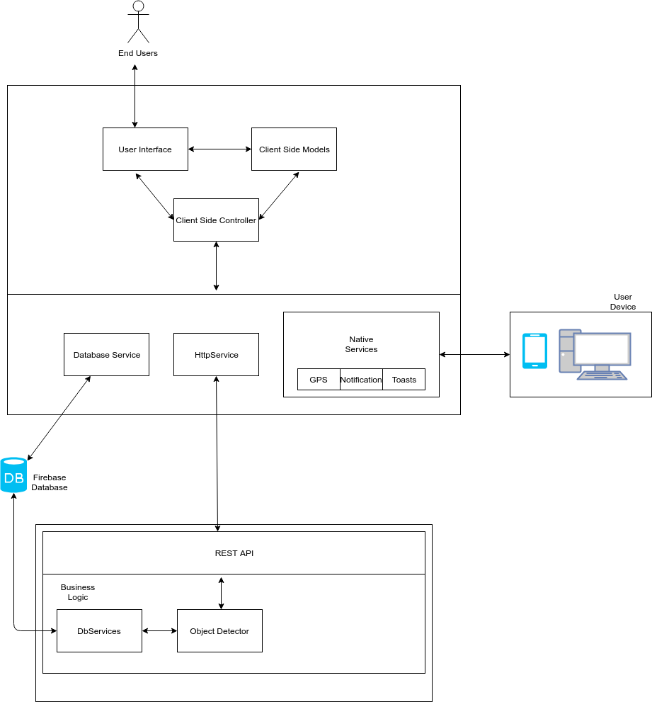

# ParkAndGo-Detection-Model

 

## Introduction

This ParkAndGo solution intends to utlize the Faster RCNN Object Detection Model to analyze CCTV Footage and identify free and occupied Parking Spaces. These locations will be updated in firebase realtime database where they will be shown to prospective users through an Ionic Mobile App or an Angular Web App

## High-Level Architecture Diagram

## Installation Steps

Install all required prerequisites by issuing the command

`pip install requirement.txt`

To run the server locally issue the following command. The flask application will listen on port 5000

`python app.py`

Optionally to run the server as a container issue the following command to generate a Docker Container

`docker build --tag <container_name>:1.0 .`

